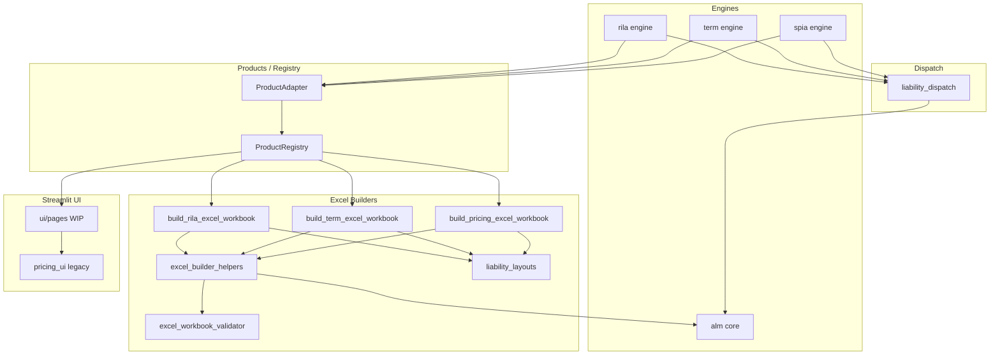

# annuity_model

Production-quality 10-product pricing engine, ALM ladder, and Excel
workbook generator. Python is the source of truth; Excel is the auditor.

**Implemented products:** SPIA, Term Life, RILA, MYGA, FIA, VA, WL, UL,
IUL, VUL. The seven products beyond the original SPIA / Term / RILA core
are now first-class products behind the same registry, UI, CLI, parity, and
workbook evidence surfaces.

## Module map

```
annuity_model/
├── src/annuity_model/             # installable package
│   ├── __init__.py                # public API surface (import from here)
│   ├── parity_constants.py        # single source of truth for tolerances
│   ├── _logging.py                # structured logging
│   ├── liability_dispatch.py      # ProductType -> liability path conversion
│   ├── liability_layouts.py       # Excel column-letter registry per product
│   ├── product_registry.py        # ProductAdapter Protocol + dispatch
│   ├── excel_workbook_validator.py
│   ├── excel_builder_helpers.py
│   ├── *_projection.py            # 10 product engines + ALM support
│   ├── alm_excel_ladder.py
│   ├── build_*_excel_workbook.py  # 10 per-product workbook builders
│   ├── product_excel.py           # build_product_workbook dispatcher
│   ├── pricing_ui.py              # Streamlit app orchestration; see ui/MIGRATION.md
│   ├── ui/                        # extracted shell, pages, widgets, diagnostics
│   ├── products/                  # per-product subpackages (10 of them)
│   └── data/                      # packaged mortality, curves, scenarios
├── scripts/
│   ├── deep_smoke.py              # end-to-end smoke (10 products, full validate)
│   ├── streamlit_cloud_smoke.py   # root requirements.txt + streamlit_app.py boot gate
│   ├── parity_trace.py            # python-vs-excel CSV trace for parity debug
│   ├── render_parity_contract.py  # rebuilds tolerance tables from constants
│   ├── render_actuarial_benchmarks.py  # rebuilds per-product band tables
│   └── generate_cso_2017_synthetic.py  # placeholder CSO data generator
├── tests/
│   ├── parity/                    # python-vs-excel parity gates (block release)
│   ├── ui/                        # Streamlit AppTest smokes (10 products)
│   └── test_*.py                  # unit tests
└── docs/
    ├── model_parity_contract.md   # SPIA + ALM tolerance contract (generated)
    ├── rila_parity_contract.md    # RILA tolerance contract (generated)
    ├── actuarial_benchmarks.md    # per-product band rationale (generated)
    ├── lapse_framework.md         # lapse v1 contract
    ├── parity_test_checklist.md   # release checklist
    ├── glossary.md                # SPIA, RILA, MYGA, FIA, VA, WL, UL, IUL, VUL, GMDB, NAR, COI, AV, M&E
    ├── CHANGELOG.md
    ├── model_change_log.md        # parity-impacting change log (governance)
    ├── CODEOWNERS_RATIONALE.md
    └── runbooks/
        ├── regenerate_excel_cache.md
        ├── debug_validator_failure.md
        ├── investigate_parity_break.md
        └── release.md
```

## Current architecture

The diagram shows the original SPIA / Term / RILA spine; the live
`ProductRegistry` dispatches **10** products (see module map above).



## Adding a new product (FIA, VA-GLWB, ...) -- the 5-step walkthrough

1. **Engine + adapter:** create `annuity_model/src/annuity_model/<product>_projection.py`
   exposing `<Product>Contract`, `price_<product>(...)`, and a
   `liability_path_from_<product>_projection(...)` function. At module bottom,
   register the converter:

   ```python
   from annuity_model.liability_dispatch import register_liability_path_converter
   register_liability_path_converter("MyProductProjectionResult", liability_path_from_my_product_projection)
   ```

2. **Excel builder + layout:** create
   `annuity_model/src/annuity_model/build_<product>_excel_workbook.py`. Add the column letters to
   `LIABILITY_LAYOUTS` in `liability_layouts.py` (this is the registry, not a
   new file). Use `liability_layout_for("<product_code>")` everywhere instead
   of hard-coded letters.

3. **Register the enum and adapter seed:** add a new `ProductType` enum value and a
   `ProductAdapter` implementation in `src/annuity_model/product_registry.py`.
   Public adapter, metric, capability, mortality, UI, validator, builder, and
   liability dispatch views are derived from `ProductDefinition`, not from new
   public dicts.

4. **Publish the canonical `ProductDefinition`:** create
   `annuity_model/src/annuity_model/products/<name>/{__init__.py, schema.py, engine.py, excel.py, ui.py}`
   following the SPIA template. The four submodules may start as re-export shims
   over legacy modules; `__init__.py` calls `register_product(ProductDefinition(...))`
   with the complete platform wire set.
   The meta-tests in `tests/test_products_registry.py` and
   `tests/test_products_subpackage_shims.py` enforce that compatibility views
   stay derived from this canonical record.

5. **Add a parity test under `tests/parity/test_<product>_parity.py`** -- copy
   `test_term_parity.py` as a template. Import tolerances from
   `parity_constants` only.

`pricing_projection.py` should not change.

## Daily commands

```bash
# Activate venv (created under annuity_model/ by bootstrap)
source .venv/bin/activate

# Run the parity-critical subset (blocks any merge on failure)
python -m pytest tests/parity -q

# Run the full unit-test suite
python -m pytest -q

# Static Excel validator on a generated workbook
python -c "from annuity_model.excel_workbook_validator import validate_workbook_or_raise; \
           import openpyxl; validate_workbook_or_raise(openpyxl.load_workbook('SPIA.xlsx'))"

# End-to-end smoke (every product in deep_smoke + full validator)
python scripts/deep_smoke.py

# Regenerate parity-contract tolerance tables from parity_constants
python scripts/render_parity_contract.py
python scripts/render_parity_contract.py --check   # used by CI

# Trace python-vs-excel discrepancy
python scripts/parity_trace.py --steps 60 --output traces/spia.csv
```

## Key invariants (CI enforces all of these)

* `parity_constants.MODELCHECK_TOL == 0.0` -- never weaken.
* Every `wb.save(...)` call site is preceded by `validate_workbook_or_raise(wb)`
  (P4 will add an AST meta-test).
* RILA liability column is `M`; SPIA / Term liability column is `S`. Source of
  truth: `LIABILITY_LAYOUTS` in `src/annuity_model/liability_layouts.py`.
* Tolerance tables in `docs/model_parity_contract.md` and
  `docs/rila_parity_contract.md` are generated from `src/annuity_model/parity_constants.py`.

## Where to look first

* New to the codebase? Read `docs/glossary.md`, then `docs/model_parity_contract.md`.
* Debugging a parity break? `docs/runbooks/investigate_parity_break.md`.
* Validator failed? `docs/runbooks/debug_validator_failure.md`.
* Cutting a release? `docs/runbooks/release.md`.
* Adding a product? The five-step walkthrough above.
