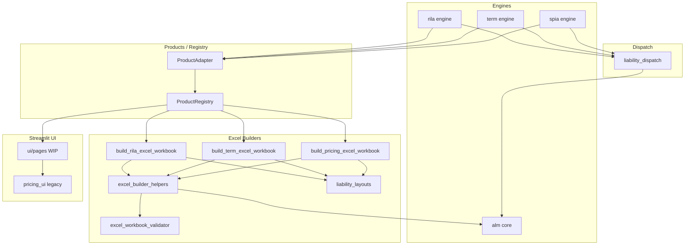

# annuity_model

Production-quality SPIA / Term Life / RILA pricing engine, ALM ladder, and Excel
workbook generator. Python is the source of truth; Excel is the auditor.

## Module map

```
annuity_model/
├── __init__.py                    # public API surface (import from here)
├── parity_constants.py            # single source of truth for tolerances
├── _logging.py                    # structured logging
├── liability_dispatch.py          # ProductType -> liability path conversion
├── liability_layouts.py           # Excel column-letter registry per product
├── product_registry.py            # ProductAdapter Protocol + dispatch
├── excel_workbook_validator.py    # static formula validator (67 fns, AST-free)
├── excel_builder_helpers.py       # shared builder utilities (public)
├── pricing_projection.py          # SPIA pricing + ALM core engine
├── term_projection.py             # Term Life pricing engine
├── rila_projection.py             # RILA pricing engine
├── alm_excel_ladder.py            # Excel ALM_Engine sheet generator
├── build_pricing_excel_workbook.py  # SPIA workbook builder
├── build_term_excel_workbook.py     # Term workbook builder
├── build_rila_excel_workbook.py     # RILA workbook builder
├── product_excel.py               # build_product_workbook dispatcher
├── pricing_ui.py                  # Streamlit app (legacy monolith; see ui/MIGRATION.md)
├── ui/                            # decomposition target for pricing_ui.py
├── scripts/
│   ├── deep_smoke.py              # end-to-end smoke (3 products, full validate)
│   ├── parity_trace.py            # python-vs-excel CSV trace for parity debug
│   └── render_parity_contract.py  # rebuilds tolerance tables from constants
├── tests/
│   ├── parity/                    # python-vs-excel parity gates (block release)
│   └── test_*.py                  # unit tests
└── docs/
    ├── model_parity_contract.md   # SPIA + ALM tolerance contract (generated)
    ├── rila_parity_contract.md    # RILA tolerance contract (generated)
    ├── parity_test_checklist.md   # release checklist
    ├── glossary.md                # SPIA, RILA, q_x, etc.
    ├── CHANGELOG.md
    ├── model_change_log.md        # parity-impacting change log (governance)
    ├── CODEOWNERS_RATIONALE.md
    └── runbooks/
        ├── regenerate_excel_cache.md
        ├── debug_validator_failure.md
        ├── investigate_parity_break.md
        └── release.md
```

## Architecture (after Phase 2 hardening)



## Adding a new product (FIA, VA-GLWB, ...) -- the 2-file walkthrough

1. **Engine + adapter (file 1):** create `annuity_model/<product>_projection.py`
   exposing `<Product>Contract`, `price_<product>(...)`, and a
   `liability_path_from_<product>_projection(...)` function. At module bottom,
   register the converter:

   ```python
   from liability_dispatch import register_liability_path_converter
   register_liability_path_converter("MyProductProjectionResult", liability_path_from_my_product_projection)
   ```

2. **Excel builder + layout (file 2):** create
   `annuity_model/build_<product>_excel_workbook.py`. Add the column letters to
   `LIABILITY_LAYOUTS` in `liability_layouts.py` (this is the registry, not a
   new file). Use `liability_layout_for("<product_code>")` everywhere instead
   of hard-coded letters.

3. **Register in `product_registry.py`:** add a new `ProductType` enum value, a
   `ProductAdapter` instance, and add it to the `_PRODUCT_ADAPTERS` /
   `_PRICING_METRIC_FORMATTERS` dicts.

4. **Add a parity test under `tests/parity/test_<product>_parity.py`** -- copy
   `test_term_parity.py` as a template. Import tolerances from
   `parity_constants` only.

That's it. `pricing_projection.py` should not change.

## Daily commands

```bash
# Activate venv (per repo root)
source ../.venv/bin/activate

# Run the parity-critical subset (blocks any merge on failure)
python -m pytest tests/parity -q

# Run the full unit-test suite
python -m pytest -q

# Static Excel validator on a generated workbook
python -c "from excel_workbook_validator import validate_workbook_or_raise; \
           import openpyxl; validate_workbook_or_raise(openpyxl.load_workbook('SPIA.xlsx'))"

# End-to-end smoke (all three products + full validator)
python scripts/deep_smoke.py

# Regenerate parity-contract tolerance tables from parity_constants
python scripts/render_parity_contract.py
python scripts/render_parity_contract.py --check   # used by CI

# Trace python-vs-excel discrepancy
python scripts/parity_trace.py --steps 60 --output traces/spia.csv
```

## Key invariants (CI enforces all of these)

* `parity_constants.MODELCHECK_TOL == 0.0` -- never weaken.
* Every `wb.save(...)` call site is preceded by `validate_workbook_or_raise(wb)`
  (P4 will add an AST meta-test).
* RILA liability column is `M`; SPIA / Term liability column is `S`. Source of
  truth: `LIABILITY_LAYOUTS` in `liability_layouts.py`.
* Tolerance tables in `docs/model_parity_contract.md` and
  `docs/rila_parity_contract.md` are generated from `parity_constants.py`.

## Where to look first

* New to the codebase? Read `docs/glossary.md`, then `docs/model_parity_contract.md`.
* Debugging a parity break? `docs/runbooks/investigate_parity_break.md`.
* Validator failed? `docs/runbooks/debug_validator_failure.md`.
* Cutting a release? `docs/runbooks/release.md`.
* Adding a product? The 2-file walkthrough above.
