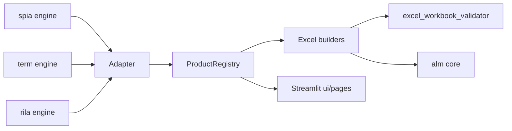

# annuity_model documentation

Production-quality **10-product** pricing engine (SPIA, Term, RILA, MYGA, FIA,
VA, WL, UL, IUL, VUL), ALM ladder, and Excel workbook generator. Python is the
source of truth; Excel is the auditor. Rollout narrative:
[`seven_product_rollout_plan.md`](seven_product_rollout_plan.md).

## Where to start

* **New to the codebase?** Read [Glossary](glossary.md) first, then the
  [SPIA / ALM parity contract](model_parity_contract.md).
* **Need the development governance map (humans + AI platforms)?** Read
  [Project development guide](../../PROJECT_DEVELOPMENT_GUIDE.md).
* **AI agent starting cold?** Read [AI_AGENT_PREFLIGHT](AI_AGENT_PREFLIGHT.md)
  before editing code.
* **Adding a product?** The walkthrough lives in
  [annuity_model/README.md](../README.md) (“Adding a new product”).
* **Debugging a parity break?** Open
  [investigate_parity_break](runbooks/investigate_parity_break.md).
* **Validator failed?** Open [debug_validator_failure](runbooks/debug_validator_failure.md).
* **Cutting a release?** Open [release](runbooks/release.md).

## Architecture

Schematic: three original engines feed the same adapter/registry pattern; nine
additional products plug into the same registry (see `product_registry.py`).

## Hard invariants

CI enforces all of these:

1. `parity_constants.MODELCHECK_TOL == 0.0` -- never weaken.
2. Every `wb.save(...)` call site is preceded by `validate_workbook_or_raise(wb)`.
3. RILA liability column is `M`; SPIA / Term liability column is `S`. Source
   of truth: `LIABILITY_LAYOUTS` in `liability_layouts.py`.
4. Tolerance tables in [model_parity_contract.md](model_parity_contract.md)
   and [rila_parity_contract.md](rila_parity_contract.md) are **generated**
   from `parity_constants.py`. From `annuity_model/`, edit the constants, then
   run `python scripts/render_parity_contract.py` (or `--check` in CI).

## Index

* [Glossary](glossary.md)
* Parity contracts: [SPIA / ALM](model_parity_contract.md),
  [RILA](rila_parity_contract.md), [Portfolio](portfolio_parity_contract.md)
* Product / runner specs: [RILA product spec](rila_product_spec.md),
  [Portfolio runner spec](portfolio_runner_spec.md)
* [Release checklist](parity_test_checklist.md)
* Runbooks: [parity break](runbooks/investigate_parity_break.md),
  [validator](runbooks/debug_validator_failure.md),
  [Excel cache](runbooks/regenerate_excel_cache.md),
  [release](runbooks/release.md),
  [assumption guardrail](runbooks/assumption_release_guardrail.md)
* Governance: [CHANGELOG](CHANGELOG.md), [model change log](model_change_log.md),
  [CODEOWNERS rationale](CODEOWNERS_RATIONALE.md),
  [model inventory](model_inventory.md),
  [assumption governance](assumption_governance.md),
  [gap register](platform_gap_register.md),
  [independent challenge activation](independent_challenge_activation.md)
* Roadmaps: [actuarial fidelity backlog](actuarial_fidelity_backlog.md),
  [platform engineering roadmap](platform_engineering_roadmap.md),
  [implementation phasing](implementation_phasing.md)
